# IronLog

**Il registro di allenamento che decide quanto caricare la prossima volta.**

IronLog è un'applicazione web full-stack per la gestione delle schede di palestra: l'atleta
registra le serie che esegue, l'app calcola da sola il carico della seduta successiva e
mostra l'andamento del volume nel tempo. Il coach assegna le schede ai propri atleti e ne
segue i progressi da un pannello dedicato.

<p>
  
  
  
  
  
</p>

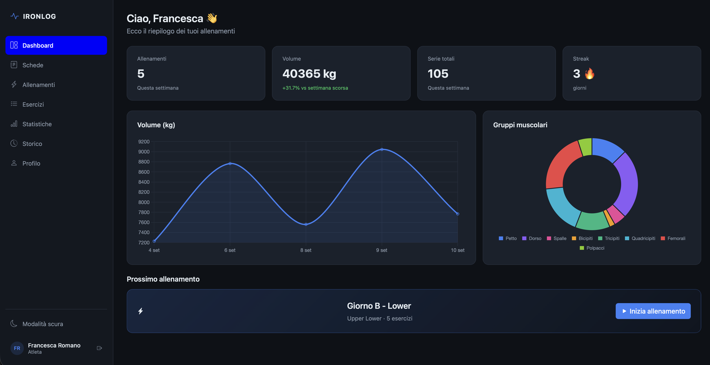

---

## Indice

- [Il problema e l'idea](#il-problema-e-lidea)
- [Funzionalità principali](#funzionalità-principali)
- [Il motore della progressione](#il-motore-della-progressione)
- [Screenshot](#screenshot)
- [Scelte architetturali](#scelte-architetturali)
- [Modello dati](#modello-dati)
- [Sicurezza](#sicurezza)
- [Stack tecnologico](#stack-tecnologico)
- [Struttura del progetto](#struttura-del-progetto)
- [Avvio in locale](#avvio-in-locale)
- [Utenti di prova](#utenti-di-prova)
- [API principali](#api-principali)
- [Test](#test)
- [Licenza](#licenza)

---

## Il problema e l'idea

Chi si allena in palestra tiene traccia delle serie su un foglio di carta o nelle note del
telefono. Il dato c'è, ma resta muto: decidere se la settimana dopo vada aggiunto un disco
o vada tolto peso è una scelta lasciata alla memoria e alle sensazioni.

IronLog parte da qui. Ogni serie registrata (peso, ripetizioni, RPE) viene confrontata con
l'obiettivo della scheda e, alla chiusura della sessione, **il carico dell'esercizio viene
aggiornato automaticamente**: si sale se l'obiettivo è stato centrato, si scarica dopo due
sedute fallite consecutive. L'atleta apre la scheda e trova già il peso giusto per oggi.

## Funzionalità principali

### Atleta

| | Funzionalità |
|---|---|
| **Schede** | Creazione di schede multi-giorno con esercizi, serie, ripetizioni, peso di partenza e recupero |
| **Allenamento live** | Apertura di una sessione, registrazione serie per serie, calcolo del massimale stimato (formula di Epley) |
| **Progressione automatica** | Aggiornamento del carico a fine sessione in base agli obiettivi raggiunti |
| **Allenamento libero** | Sessioni fuori scheda, per registrare anche ciò che non è programmato |
| **Storico** | Elenco di tutte le sessioni concluse con volume, serie e durata |
| **Statistiche** | Volume per gruppo muscolare, andamento settimanale/mensile, streak di allenamenti, variazione percentuale sul periodo precedente |
| **Catalogo esercizi** | 52 esercizi suddivisi in 9 gruppi muscolari, con ricerca e preferiti |
| **Profilo** | Cambio password, azzeramento dello storico, eliminazione dell'account |

### Coach

| | Funzionalità |
|---|---|
| **Clienti** | Elenco degli atleti assegnati, con accesso al dettaglio di ciascuno |
| **Assegnazione schede** | Creazione di una scheda direttamente per un cliente |
| **Statistiche clienti** | Confronto di volume e frequenza di allenamento tra gli atleti seguiti |
| **Profilo** | Gestione dell'account coach |

### Trasversali

- Autenticazione con JWT e rotte protette per ruolo
- Tema **scuro e chiaro**, con i grafici che si ridisegnano seguendo il tema attivo
- Interfaccia **responsive**: stessa applicazione da desktop e da smartphone, con la sessione di allenamento pensata per essere registrata dal telefono tra una serie e l'altra

## Il motore della progressione

Il cuore dell'applicazione è la classe `CalcolatoreProgressione`, isolata dal resto della
logica e coperta da test unitari.

Alla chiusura di una sessione collegata a un giorno di scheda, per ogni esercizio:

```
tutte le serie hanno raggiunto le ripetizioni obiettivo?
├── SÌ  → peso × 1,025, arrotondato al disco da 1,25 kg
│         sedute fallite azzerate
└── NO  → sedute fallite + 1
          se sedute fallite ≥ 2 → peso × 0,90 (deload), contatore azzerato
```

Due accorgimenti tengono la progressione sempre viva:

- **sotto i 25 kg** il 2,5% è inferiore a mezzo disco e l'arrotondamento riporterebbe al
  peso di partenza: in quel caso si sale comunque di un disco pieno;
- in modo simmetrico, il deload scende **sempre di almeno un disco**, senza mai andare
  sotto lo zero.

Tutti i pesi sono gestiti con `BigDecimal` per evitare gli errori di arrotondamento del
virgola mobile.

## Screenshot

L'interfaccia è responsive e pensata per essere usata **sia da desktop sia da smartphone**:
il layout passa dalla sidebar fissa del desktop alla navigazione compatta del telefono, così
la sessione di allenamento si registra comodamente dal cellulare, tra una serie e l'altra,
mentre le schermate di analisi rendono al meglio sullo schermo grande. Gli screenshot che
seguono alternano le due viste.

### Accesso
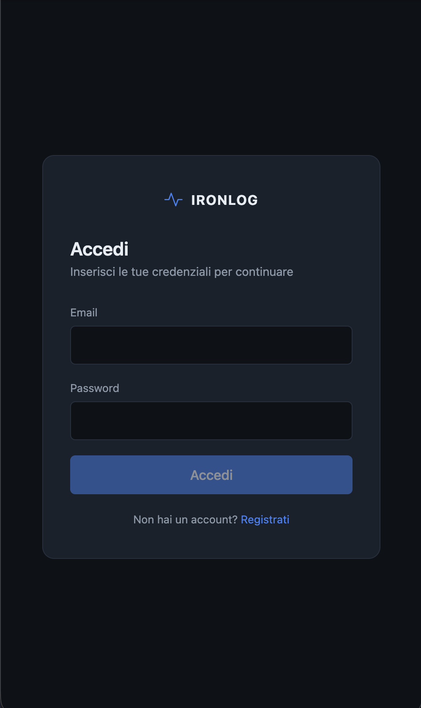
*Vista mobile. Login con validazione dei campi e messaggi di errore dedicati; da qui si accede anche alla registrazione, dove si sceglie il ruolo e, per gli atleti, il coach di riferimento.*

### Dashboard

*Riepilogo della settimana — allenamenti, serie, volume totale e variazione rispetto ai sette giorni precedenti — con il prossimo allenamento suggerito dalla scheda attiva.*

### Le schede
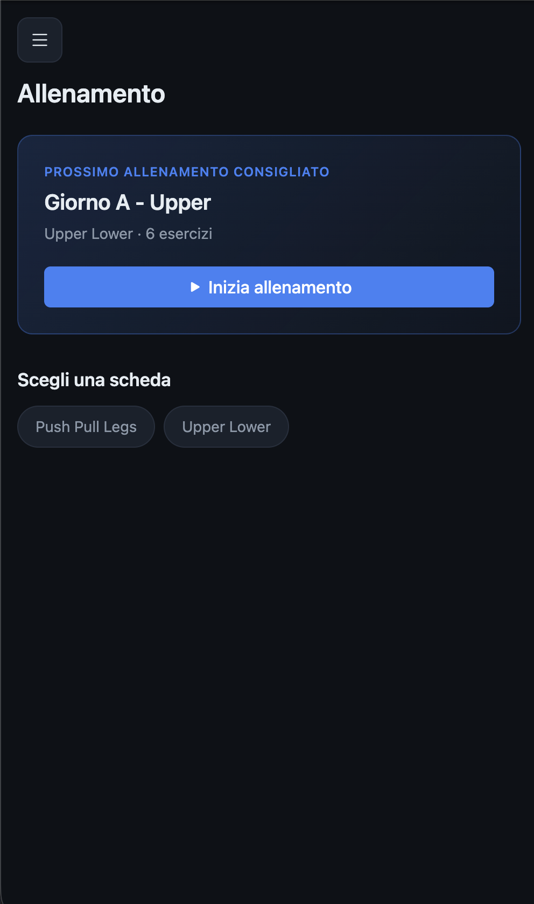
*Vista mobile. Elenco delle schede dell'atleta, con indicazione di quella attiva, dell'autore (l'atleta stesso o il suo coach) e della data di inizio.*

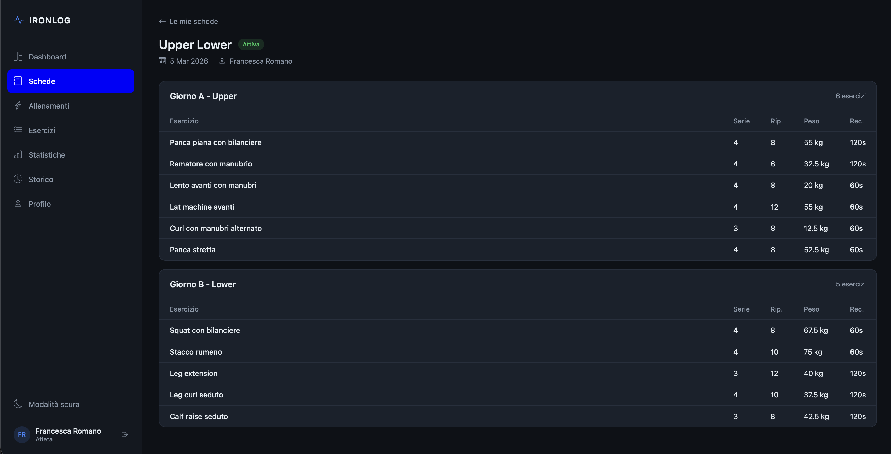
*Dettaglio di una scheda: i giorni di allenamento e, per ciascun esercizio, serie, ripetizioni obiettivo e il carico corrente aggiornato dalla progressione automatica.*

### La sessione di allenamento
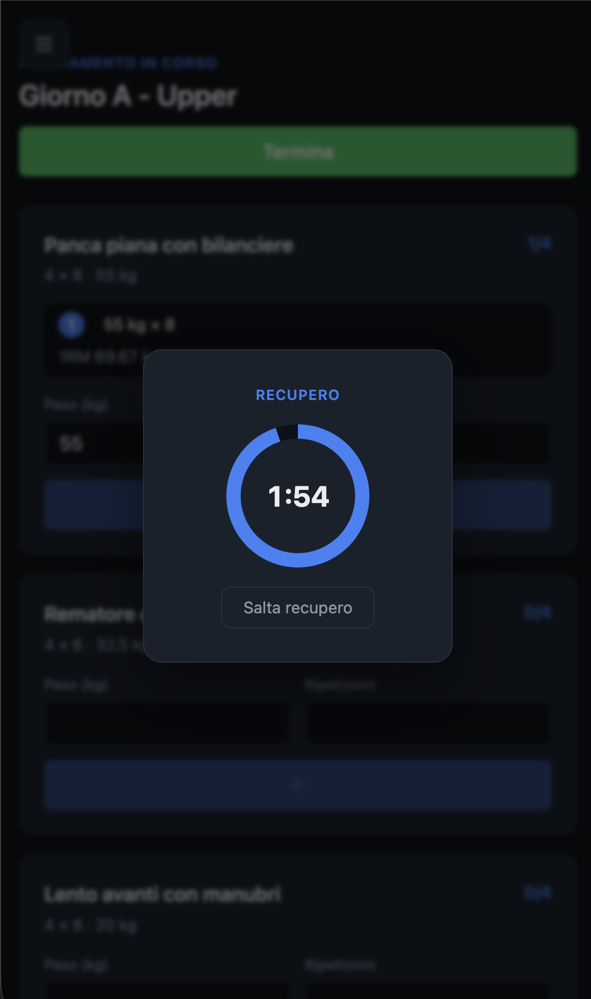
*Registrazione live da smartphone: si inseriscono peso e ripetizioni serie dopo serie, l'app calcola il massimale stimato e fa partire il timer di recupero dell'esercizio. Alla chiusura restituisce durata, volume e serie completate.*

### Statistiche
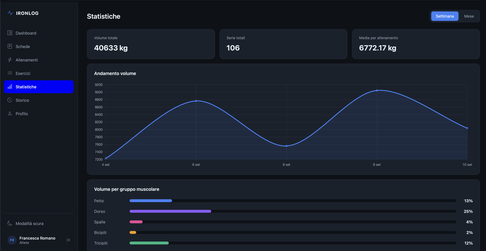
*Grafici Chart.js sul volume per gruppo muscolare e sull'andamento nel tempo, con selettore di periodo (settimana o mese).*

### Catalogo e storico
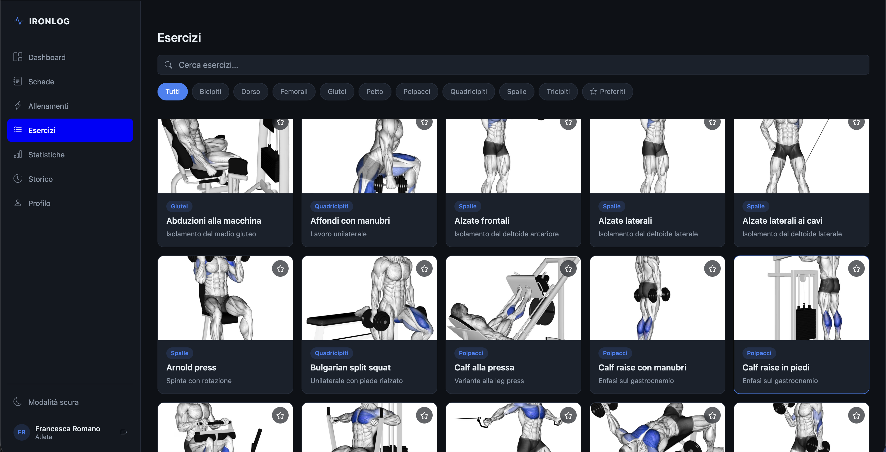
*Catalogo di 52 esercizi filtrabili per gruppo muscolare e per testo, con la possibilità di segnare i preferiti.*

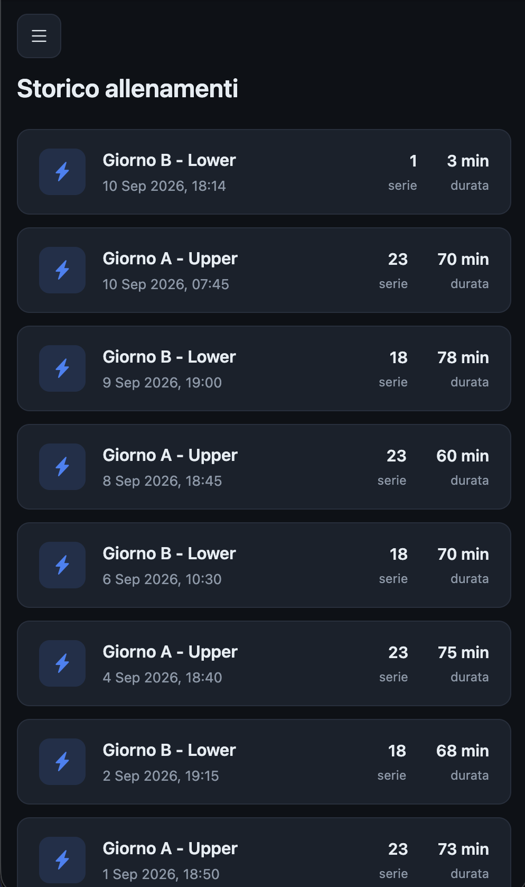
*Vista mobile. Storico delle sessioni concluse, dalla più recente, con volume e numero di serie di ogni allenamento.*

### Area coach
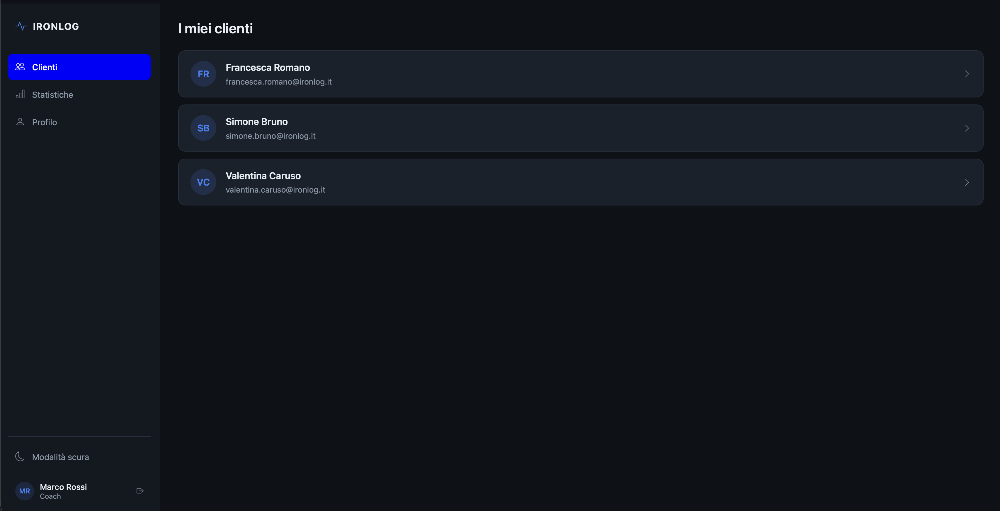
*Elenco degli atleti seguiti dal coach, con accesso rapido al dettaglio e alla creazione di una nuova scheda.*

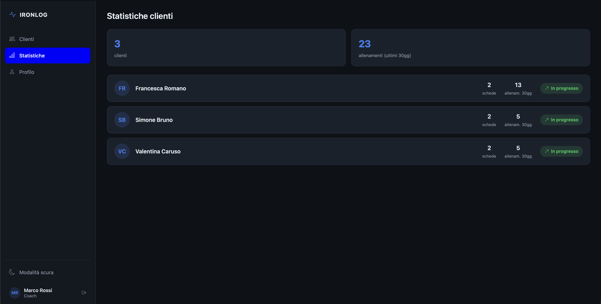
*Confronto tra i clienti su volume e frequenza di allenamento, per capire a colpo d'occhio chi sta rispettando il programma.*

## Scelte architetturali

### Due applicazioni separate

Backend e frontend sono due progetti indipendenti nello stesso repository: il server espone
solo **API REST in JSON**, il client Angular è un'applicazione a sé. Il vantaggio è che
l'interfaccia può essere sostituita (o affiancata da un'app mobile) senza toccare il
dominio.

```
┌─────────────────────┐   HTTP/JSON + JWT   ┌──────────────────────┐        ┌─────────┐
│   Angular 19 (SPA)  │ ──────────────────► │  Spring Boot 4 API   │ ─────► │  MySQL  │
│  standalone comps   │ ◄────────────────── │   :8080              │        │    8    │
└─────────────────────┘                     └──────────────────────┘        └─────────┘
        :4200
```

### Backend a tre livelli

```
Controller  →  Service (interfaccia + implementazione)  →  Repository  →  MySQL
     ↑                          ↓
    DTO   ←─────  Mapper  ─────  Entity
```

- **Controller**: solo instradamento e validazione (`@Valid`), nessuna logica di dominio.
- **Service**: ogni servizio è definito da un'interfaccia in `service/definition` e
  implementato in `service`. La logica della progressione è estratta in un componente
  dedicato (`CalcolatoreProgressione`), così è testabile senza database.
- **Repository**: Spring Data JPA, con query derivate dai nomi dei metodi. Le query di
  lettura sono **sempre filtrate sull'utente autenticato**
  (`findByIdAndGiornoSchedaSchedaAtleta`, `findByIdAndAtleta`, …): l'isolamento dei dati è
  garantito dalla query, non da un controllo successivo.
- **DTO e Mapper**: le entità JPA non escono mai dal backend. Ogni risorsa ha DTO distinti
  per richiesta e risposta, e la conversione è centralizzata nei mapper.

### Gestione degli errori

Un `@RestControllerAdvice` (`GlobalExceptionHandler`) traduce le eccezioni di dominio
(`SessioneGiaApertaException`, `SchedaNonTrovataException`, `CredenzialiNonValideException`, …)
in risposte JSON uniformi con lo status HTTP corretto. I controller non contengono
`try/catch`.

### Frontend

- **Standalone components** e routing con lazy loading delle pagine.
- **Guard** `authGuard` e `coachGuard` sulle rotte, così la parte coach non è raggiungibile
  da un atleta nemmeno digitando l'URL.
- **HTTP interceptor** funzionale: aggiunge l'header `Authorization` a ogni chiamata e, su
  un 401 che non arrivi dal login, azzera la sessione e riporta alla pagina di accesso.
- **Servizi tipizzati** con modelli TypeScript speculari ai DTO del backend.
- **ThemeService**: legge i colori dalle variabili CSS e li passa a Chart.js, in modo che i
  grafici cambino colore insieme al tema invece di avere valori fissi.

### Configurazione esterna

Credenziali del database, segreto JWT, origini CORS e strategia di creazione dello schema
sono variabili d'ambiente con valore di default: nessun segreto è versionato.

## Modello dati

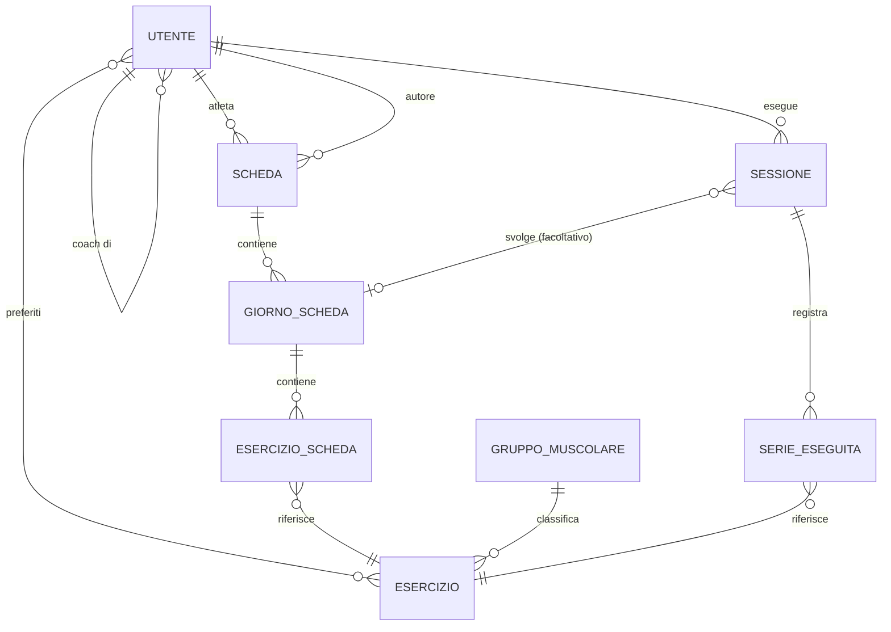

Due scelte meritano una nota:

- `Sessione.giornoScheda` è **facoltativa**: senza di essa la sessione è un allenamento
  libero, che entra nello storico e nelle statistiche ma non fa scattare la progressione.
- `EsercizioScheda` porta con sé `pesoAttuale` e `seduteFallite`: lo stato della
  progressione vive sulla riga di scheda, non va ricalcolato ogni volta dallo storico.

## Sicurezza

Autenticazione **stateless** con JSON Web Token, secondo l'impostazione classica di Spring
Security:

1. `Utente` implementa direttamente `UserDetails`, con `email` come username e i ruoli
   esposti come `ROLE_ATHLETE` / `ROLE_COACH`.
2. Le password sono cifrate con **BCrypt**.
3. Al login `JwtService` firma un token HMAC-SHA256, restituito nell'header
   `Authorization`.
4. `JwtAuthFilter`, registrato prima di `UsernamePasswordAuthenticationFilter`, valida il
   token a ogni richiesta e delega gli errori a `HandlerExceptionResolver`, così anche i
   fallimenti nel filtro passano dal gestore globale delle eccezioni.
5. L'autorizzazione è **per prefisso di path**: `/auth/**` è pubblico, `/atleta/**` richiede
   il ruolo atleta, `/coach/**` il ruolo coach, tutto il resto va autenticato.
6. La sessione HTTP è disabilitata (`SessionCreationPolicy.STATELESS`), CSRF disattivato,
   CORS configurabile da variabile d'ambiente.

## Stack tecnologico

| Backend | Frontend |
|---|---|
| Java 25 | Angular 19 (standalone components) |
| Spring Boot 4.1 (Web MVC) | TypeScript 5.7 |
| Spring Security + JJWT 0.12 | RxJS 7 |
| Spring Data JPA / Hibernate | Chart.js 4 |
| Bean Validation | Bootstrap 5.3 + Bootstrap Icons |
| Lombok | jwt-decode |
| MySQL 8 | Angular CLI |
| Maven | npm |

## Struttura del progetto

```
IronLog/
├── ironlog-backend/
│   └── src/main/java/org/ironlog/app/
│       ├── controller/     # endpoint REST (auth, catalogo, schede, sessioni, statistiche, coach)
│       ├── service/        # logica applicativa + service/definition (interfacce)
│       ├── repository/     # Spring Data JPA
│       ├── model/          # entità e enum (Ruolo, PeriodoStatistica)
│       ├── dto/            # oggetti di richiesta e risposta
│       ├── mapper/         # conversione entità ↔ DTO
│       ├── exception/      # eccezioni di dominio + GlobalExceptionHandler
│       └── security/       # SecurityConfig, JwtService, JwtAuthFilter, UserDetailsService
├── ironlog-frontend/
│   └── src/app/
│       ├── pages/          # 13 pagine (dashboard, schede, sessione, statistiche, area coach…)
│       ├── layout/         # main layout e sidebar
│       ├── services/       # client HTTP tipizzati + ThemeService
│       ├── models/         # interfacce TypeScript speculari ai DTO
│       ├── interceptors/   # auth.interceptor
│       └── app.guard.ts    # authGuard e coachGuard
└── docs/screenshots/
```

## Avvio in locale

### Prerequisiti

- JDK 25
- MySQL 8 in ascolto su `localhost:3306`
- Node.js 20+ e npm

### Backend

```bash
cd ironlog-backend

export DB_USER=root
export DB_PASS=la_tua_password
export JWT_SECRET=una_stringa_di_almeno_32_caratteri_random

./mvnw spring-boot:run
```

Il database `ironlog` viene creato al primo avvio e popolato da `data.sql` con utenti,
catalogo esercizi, schede e sessioni di esempio.

| Variabile | Default | Note |
|---|---|---|
| `DB_USER` | `root` | utente MySQL |
| `DB_PASS` | — | obbligatoria |
| `JWT_SECRET` | — | obbligatoria, almeno 32 caratteri |
| `JWT_EXPIRATION_MS` | `86400000` | durata del token (24 h) |
| `DDL_AUTO` | `create` | usare `update` per conservare i dati tra i riavvii |
| `SQL_INIT` | `always` | esecuzione di `data.sql` |
| `CORS_ORIGINS` | `http://localhost:*` | aggiungere qui l'IP della macchina per provare l'app dal telefono |

### Frontend

```bash
cd ironlog-frontend
npm install
npm start
```

L'applicazione è su <http://localhost:4200> e punta al backend indicato in
`src/environments/environment.ts`.

> **Dal telefono, sulla stessa rete Wi-Fi:** in `environment.ts` sostituire `localhost` con
> l'IP della macchina, avviare il frontend con `ng serve --host 0.0.0.0` e aggiungere quello
> stesso IP a `CORS_ORIGINS`.

## Utenti di prova

Tutti gli utenti creati da `data.sql` hanno password `password`.

| Ruolo | Email |
|---|---|
| Coach | `marco.rossi@ironlog.it` |
| Atleta (seguito da Marco Rossi) | `francesca.romano@ironlog.it` |
| Atleta senza coach | `davide.conti@ironlog.it` |

## API principali

Tutte le rotte, tranne `/auth/**`, richiedono l'header `Authorization: Bearer <token>`.

| Metodo | Endpoint | Descrizione |
|---|---|---|
| `POST` | `/auth/register` | Registrazione (atleta o coach) |
| `POST` | `/auth/login` | Login, restituisce il JWT |
| `GET` | `/auth/coach` | Elenco dei coach selezionabili in registrazione |
| `GET` | `/catalogo/esercizi` · `/catalogo/gruppi` | Catalogo esercizi e gruppi muscolari |
| `GET` | `/catalogo/esercizi/cerca` | Ricerca testuale |
| `POST` `DELETE` | `/catalogo/esercizi/{id}/preferito` | Gestione dei preferiti |
| `GET` `POST` | `/atleta/schede` | Elenco e creazione schede |
| `GET` | `/atleta/schede/{id}` | Dettaglio scheda |
| `GET` | `/atleta/schede/prossimo` | Prossimo allenamento suggerito |
| `POST` | `/atleta/sessioni` | Apertura sessione (con o senza giorno di scheda) |
| `POST` | `/atleta/sessioni/{id}/serie` | Registrazione di una serie |
| `PATCH` | `/atleta/sessioni/{id}/conclusione` | Chiusura sessione e progressione dei carichi |
| `GET` | `/atleta/sessioni/aperta` · `/atleta/sessioni` | Sessione in corso e storico |
| `GET` | `/atleta/statistiche/dashboard` | Riepilogo settimanale e streak |
| `GET` | `/atleta/statistiche/volume` · `/andamento` · `/riepilogo` | Statistiche per gruppo e nel tempo |
| `GET` `PUT` `DELETE` | `/atleta/profilo` | Profilo, cambio password, eliminazione account |
| `GET` | `/coach/atleti` | Clienti del coach |
| `GET` `POST` | `/coach/atleti/{id}/schede` | Schede di un cliente e assegnazione |
| `GET` | `/coach/statistiche/clienti` | Statistiche comparate dei clienti |

## Test

```bash
cd ironlog-backend
./mvnw test
```

`CalcolatoreProgressioneTest` copre l'algoritmo di progressione: aumento del 2,5%,
arrotondamento al disco, deload del 10%, i casi limite sui carichi leggeri e la verifica
del completamento delle serie.

## Licenza

Distribuito con licenza MIT — vedi [LICENSE](LICENSE).

---

Progetto sviluppato da **David De Nicola** durante il Master ELIS "Sviluppo App & Servizi".
